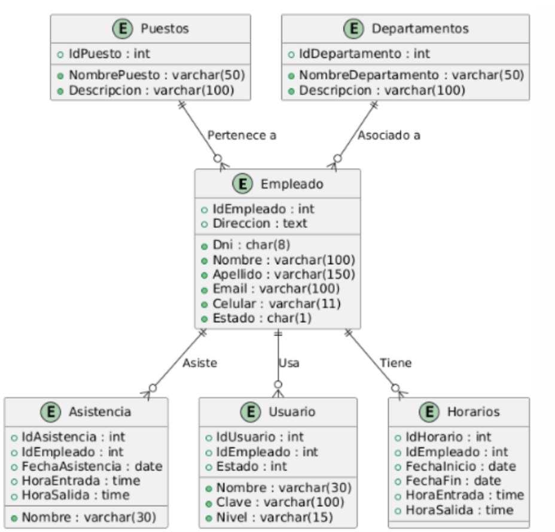
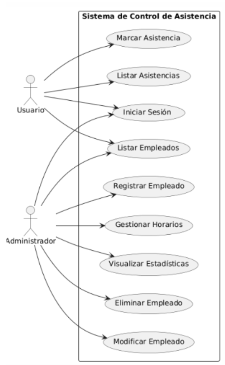
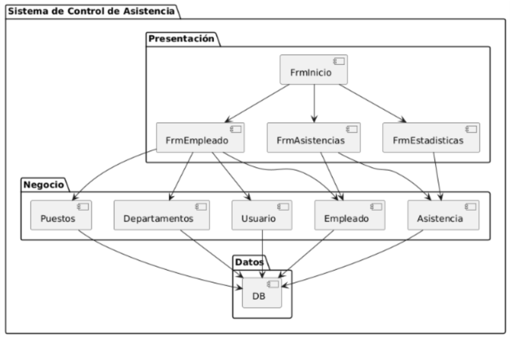
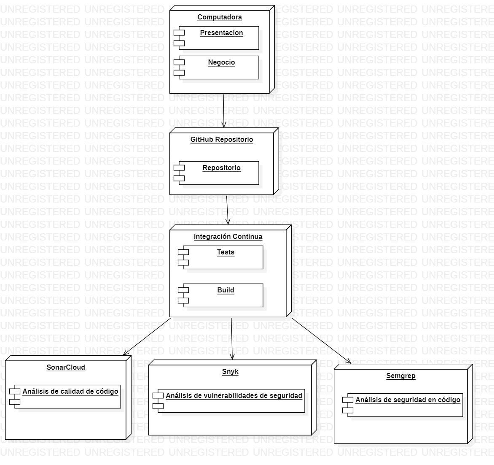

[comment]: 

**UNIVERSIDAD PRIVADA DE TACNA**

**FACULTAD DE INGENIERIA**

**Escuela Profesional de Ingeniería de Sistemas**

**Proyecto *“Control de Asistencia”***

Curso: *Calidad y Pruebas de Software*

Docente: *Ing. Cuadros Quiroga, Patrick Jose*

Integrantes:

***
Paja De la Cruz, Piero Alexander			(2020067576)

Contreras Lipa, Alvaro Javier 			(2021070020)

Hernández Cruz, Angel Gadiel		 	(2021070017)
***

**Tacna – Perú**

***2024***

**  
**

\pagebreak

Sistema *{Nombre del Sistema}*

Informe de Factibilidad

Versión *{1.0}*

|CONTROL DE VERSIONES||||||
| :-: | :- | :- | :- | :- | :- |
|Versión|Hecha por|Revisada por|Aprobada por|Fecha|Motivo|
|1\.0|MPV|ELV|ARV|10/10/2020|Versión Original|

\pagebreak

# **INDICE GENERAL**

Resumen

Abstract

[1. Antecedentes](#_Toc52661346)

[2. Titulo](#_Toc52661347)

[3. Autores](#_Toc52661348)

[4. Planteamiento del problema](#_Toc52661349)

[4.1 Problema](#_Toc52661350)

[4.2 Justificación](#_Toc52661351)

[4.3 Alcance](#_Toc52661352)

[5. Objetivos](#_Toc52661356)

[5.1 General](#_Toc52661350)

[5.2 Especificos](#_Toc52661351)

[6. Referentes teóricos](#_Toc52661357)

[7. Desarrollo de la propuesta](#_Toc52661356)

[7.1 Tecnología de información ](#_Toc52661350)

[7.2 Metodología, técnicas usadas](#_Toc52661351)

[7. Cronograma](#_Toc52661356)

\pagebreak

**<u>Tema: Control de Asistencia</u>**

1. **Antecedentes o introducción**

    Cuando el usuario ingresa sus datos para iniciar sesión en la interfaz del sistema de control de asistencia, se le asignará un rol según su nivel de relevancia dentro del sistema (por ejemplo, usuario común, administrador, supervisor). Esta información se almacenará en una base de datos creada anteriormente, asegurando que los nombres de usuario y contraseñas sean únicos. 

2. **Titulo**

    Control Asistencia

3. **Autores**

* Contreras Lipa, Alvaro Javier
* Hernandez Cruz, Angel Gadiel
* Paja De la Cruz, Piero Alexander

4. **Planteamiento del problema**

    4.1. Problema

    La problemática que motiva la implementación de la codificación en el sistema de control de asistencia es la privacidad de los usuarios. La protección de datos como el DNI, número telefónico e incluso los nombres genera preocupación, por lo que se optó por codificar toda la información. De esta manera, solo podrán acceder a los datos aquellos que estén autorizados y tengan una relación directa con el empleado registrado.

    4.2. Justificación

    La implementación de la codificación en el sistema de control de asistencia se justifica principalmente para proteger la privacidad de los usuarios, asegurando que datos sensibles como el DNI, número telefónico y nombres estén resguardados. Esta medida responde a la necesidad de prevenir el acceso no autorizado y posibles usos indebidos de la información personal, garantizando que solo personas directamente relacionadas con el empleado registrado puedan acceder a estos datos. De este modo, se preserva la confidencialidad y se cumple con las normativas de protección de datos personales, evitando controversias y posibles daños a los individuos involucrados.

    4.3. Alcance

    El alcance principal del sistema está limitado únicamente a personas autorizadas que cuenten con un usuario registrado, garantizando así que no haya divulgación o filtración de información.

5. **Objetivos**

    5.1. General

    El objetivo principal es un diseño minimalista que proporcione un ambiente amigable, permitiendo al usuario acceder y utilizar el sistema con facilidad, así como ingresar o encontrar rápidamente los datos necesarios.

    5.2. Especifico
   
    * Evitar la vulneración de contraseñas mediante ataques de diccionario.
    * Prevenir la exposición de datos personales.
    * Facilitar la navegación en relación con los usuarios registrados.

6. **Referentes teóricos**
    Diagramas de Casos de Uso, Diagrama de Clases, Diagrama de Componentes y Arquitectura.

**REQUERIMIENTOS FUNCIONALES**

- **RF1**: Autenticación: El sistema debe permitir el inicio de sesión mediante un nombre de usuario y contraseña. **(Prioridad: Alta)**
- **RF2**: Validación de Usuario: El sistema debe verificar la validez del usuario y contraseña utilizando un procedimiento almacenado. **(Prioridad: Alta)**
- **RF3**: Gestión de Empleados: El sistema debe permitir agregar, modificar y eliminar empleados. **(Prioridad: Alta)**
- **RF4**: Visualización de Empleados: El sistema debe listar todos los empleados registrados en un DataGridView. **(Prioridad: Alta)**
- **RF5**: Marcar Asistencia: El sistema debe permitir marcar la asistencia de un empleado usando su nombre y DNI. **(Prioridad: Alta)**
- **RF6**: Listado de Asistencias: El sistema debe mostrar las asistencias marcadas por día. **(Prioridad: Alta)**
- **RF7**: Obtener Faltas: El sistema debe permitir obtener las faltas de los empleados. **(Prioridad: Media)**
- **RF8**: Configuración de Áreas y Puestos: El sistema debe permitir seleccionar áreas y puestos desde un combo box. **(Prioridad: Media)**
- **RF9**: Interacción de UI: El sistema debe proporcionar retroalimentación visual (ej. cambio de color al pasar el mouse) para mejorar la experiencia del usuario. **(Prioridad: Media)**
- **RF10**: Limpiar Campos: El sistema debe permitir limpiar los campos de entrada después de realizar una acción. **(Prioridad: Media)**

**DEFINICIÓN, SIGLAS Y ABREVIATURAS**

**Definiciones:**
- **LOGIN**: Proceso de autenticación para usuarios y administradores en el sistema.
- **FrmAsistencias**: Formulario para marcar y gestionar la asistencia de los empleados.
- **FrmEmpleado**: Formulario dedicado a la gestión de información de los empleados, incluyendo agregar, modificar y eliminar registros.
- **FrmEstadisticas**: Formulario que muestra estadísticas relacionadas con la asistencia de los empleados.
- **FrmInicio**: Pantalla principal del sistema que ofrece acceso a diferentes funcionalidades y opciones.
- **FrmLista**: Formulario que muestra una lista de empleados registrados y permite la selección para ver detalles o realizar acciones.

**Siglas y Abreviaturas:**
- **UI (User Interface)**: Interfaz de usuario que debe ser intuitiva y fácil de usar.
- **DB (Database)**: Base de datos utilizada por el sistema para almacenar información de los empleados y sus asistencias.
- **CRUD (Create, Read, Update, Delete)**: Conjunto de operaciones básicas para la gestión de datos en la base de datos.

**DIAGRAMA ENTIDAD-RELACIÓN**

**DIAGRAMA DE CASOS DE USO**

**DIAGRAMA DE COMPONENTES**

**DIAGRAMA DE DESPLIEGUE**

7. Desarrollo de la propuesta 
SONARCLOUD

Versión Corregida (Con soporte asincrónico):

**Descripción de los cambios:**

**Cambio de Run() a RunAsync():**

* En el código antiguo, el método app.Run() se utilizaba de manera sincrónica, lo que no es eficiente para aplicaciones que manejan múltiples solicitudes concurrentes. Ahora, se usa await app.RunAsync() para permitir que la aplicación se ejecute de forma asincrónica, mejorando la capacidad de respuesta de la aplicación.

**Método principal async Task Main:**

* El método principal se ha modificado para ser asincrónico, utilizando async Task Main en lugar de solo void Main. Esto permite el uso de await en el código principal del programa, lo que es necesario para las operaciones asincrónicas.

**Uso de Task.FromResult en el endpoint:**

* El uso de Task.FromResult con await es un patrón que prepara la aplicación para operaciones asincrónicas en endpoints. Aún si el resultado es inmediato, este enfoque permite evitar bloqueos y manejar de forma efectiva operaciones de larga duración, mejorando el rendimiento de la aplicación al escalar con múltiples solicitudes concurrentes. 

8. Cronograma
   (personas, tiempo, otros recursos) Basado en las observaciones que la herramienta SonarQube les informara         sobre la aplicación, a fin de reducir la deuda tecnica, vulnerabilidades, fallas, etc. a 0.
